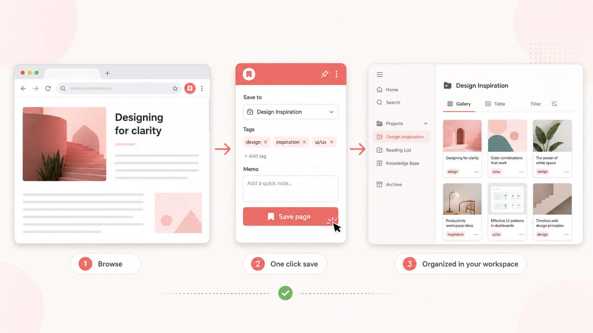

# Raku Raku Notion

**見つけた情報を、その場でNotionへ。**

Raku Raku Notionは、WebページやYouTube動画を、あとで活用しやすい形でNotionに保存するブラウザ拡張機能です。



記事のURLだけをブックマークするのではなく、**本文・画像・動画・サムネイルなどを自動で取り込み、タグや自分のメモと一緒に保存**できます。保存先のデータベースも拡張機能から作れるので、Notion側で先に細かな準備をする必要はありません。

## こんなときに使えます

- 気になった記事を「あとで読む」リストへ集めたい
- 技術資料やデザイン事例を、テーマ別のデータベースに整理したい
- レシピや旅行先など、画像付きで見返したい情報を残したい
- YouTube動画を「どこまで見たか」分かる再生位置付きで保存したい
- ページを保存するときに、思いついたメモやタグも一緒に残したい

## できること

### 1. 閲覧中のページをすぐに保存

拡張機能を開き、保存先を選んで「このページを保存」を押すだけです。ページのタイトルとURLに加えて、本文、画像、動画、サムネイル、ページアイコンを自動で取得し、Notionページとして保存します。

保存したページはギャラリーで見やすく並ぶため、URLだけの一覧よりも内容を思い出しやすくなります。

### 2. 用途ごとに保存先を分けて整理

「技術記事」「レシピ」「デザイン参考」など、用途に合わせた保存先を複数作成できます。新しい保存先を作ると、必要なプロパティを備えたNotionデータベースとギャラリービューが自動で用意されます。

### 3. タグとメモを添えて、あとで探しやすく

保存時に既存のタグを選んだり、その場で新しいタグを追加したりできます。自由入力のメモも一緒に残せるため、「なぜ保存したのか」「次に何を試すか」まで情報とセットで管理できます。

### 4. YouTubeを再生位置付きでクリップ

YouTubeでは、保存ボタンを押した時点の再生位置をURLに含めて保存します。サムネイルや動画情報も取り込むので、学習動画や長い配信の続きを見返す用途にも便利です。

### 5. Notionの画面をシンプルに表示

「Notion UI簡略化」をオンにすると、Notionのサイドバーやツールバーを隠し、コンテンツに集中できる表示へ切り替えられます。設定はいつでも元に戻せます。

## 使い方は3ステップ

1. **Notionと接続する** — 拡張機能からOAuth認証を行います。
2. **保存先を選ぶ** — 既存の保存先を選ぶか、新しいデータベースを作成します。
3. **ページを保存する** — 必要に応じてタグやメモを追加し、「このページを保存」を押します。

拡張機能はツールバーのアイコンのほか、右クリックメニューや `Ctrl + Shift + Y` からも開けます。

詳しい操作方法は[使い方ガイド](docs/USAGE.md)を参照してください。

## 保存される情報

| 情報 | 内容 |
| --- | --- |
| タイトル・URL | 元のページへすぐ戻れる基本情報 |
| 本文 | ページから抽出した読み返し用テキスト |
| 画像・動画 | ページ内の主要なビジュアルや動画 |
| カバー・アイコン | ギャラリーで内容を見分けやすくする画像 |
| タグ | テーマや用途による分類 |
| メモ | 保存時に自分で追記したコメント |

サイトの構造やアクセス制限によっては、一部の本文・画像を取得できない場合があります。

## プライバシー

Raku Raku Notionは、必要なときだけ閲覧中のタブへアクセスする設計です。

- クリップした情報の送信先はNotionです
- 広告・アクセス解析・第三者の追跡ツールは使用しません
- 認証情報や設定はChromeのローカルストレージに保存します
- ページ情報の取得は、ユーザーが保存操作をしたときに実行します

権限とデータの扱いは[権限とプライバシー](docs/PERMISSIONS.md)で詳しく説明しています。

## 開発版をインストールする

現在は、このリポジトリから開発版をビルドしてChromeへ読み込みます。

```bash
git clone https://github.com/otagao/raku-raku-notion.git
cd raku-raku-notion
npm install
npm run dev
```

続いてChromeで `chrome://extensions` を開き、次の手順で読み込みます。

1. 「デベロッパーモード」をオンにする
2. 「パッケージ化されていない拡張機能を読み込む」を選ぶ
3. `build/chrome-mv3-dev` フォルダを指定する
4. 拡張機能を開き、「Notionで認証して接続」を選ぶ

環境構築やOAuth設定の詳細は[セットアップガイド](docs/SETUP.md)と[Notion認証設定](docs/NOTION_AUTH.md)を参照してください。

## 開発者向け情報

Raku Raku Notionは、React、TypeScript、Plasmoで作られています。

```bash
npm run dev    # 開発モード
npm run build  # プロダクションビルド
```

- [アーキテクチャ](docs/ARCHITECTURE.md)
- [開発ガイド](docs/DEVELOPMENT.md)
- [OAuth設定ガイド](docs/OAUTH_SETUP_GUIDE.md)
- [Cloudflare Workers設定](docs/WORKERS_SETUP_GUIDE.md)
- [変更履歴](CHANGELOG.md)

## ライセンス・お問い合わせ

[ISC License](LICENSE) © 2024–2025 Team Bookmark (True)

不具合の報告や機能の提案は、[GitHub Issues](https://github.com/otagao/raku-raku-notion/issues)へお願いします。
